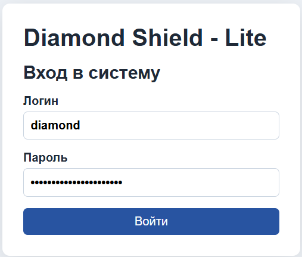
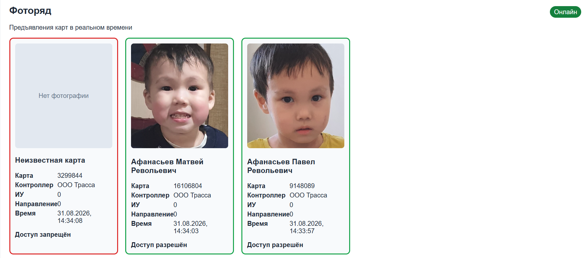
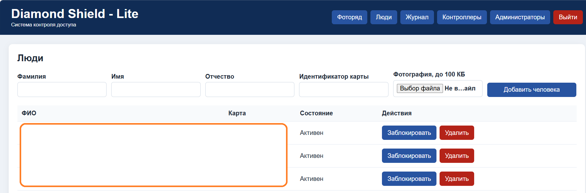
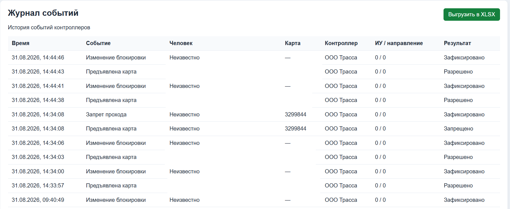
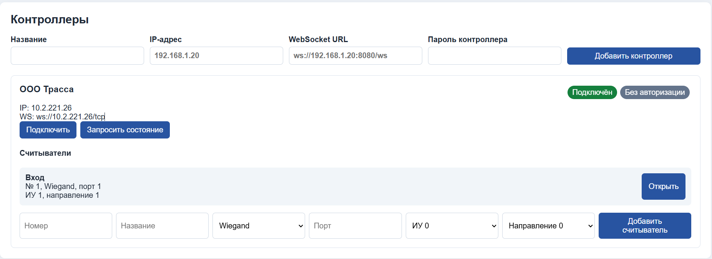
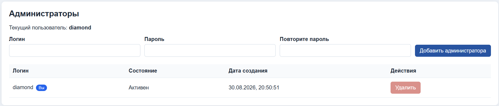
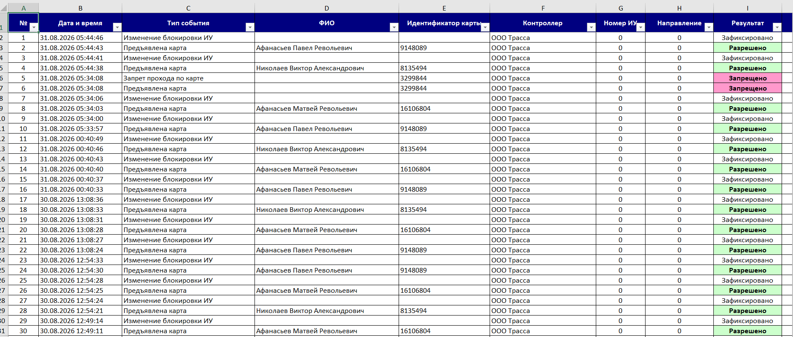
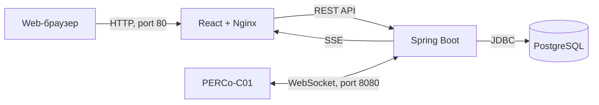

# Diamond Shield - Lite

**Diamond Shield - Lite** — минимальная клиент-серверная система контроля доступа для работы с контроллером **PERCo-C01** по протоколу WebSocket.

Система принимает события предъявления карт и проходов, сопоставляет идентификатор карты с человеком в базе данных, показывает фотографию и ФИО в реальном времени, сохраняет журнал событий и позволяет управлять контроллерами и считывателями.

> Проект является минимальной версией системы контроля доступа. Перед промышленной эксплуатацией необходимо дополнительно настроить HTTPS/WSS, резервное копирование и защиту сетевого доступа.

---

## Содержание

- [Возможности](#возможности)
- [Скриншоты](#скриншоты)
- [Архитектура](#архитектура)
- [Технологии](#технологии)
- [Структура репозитория](#структура-репозитория)
- [Docker-образы](#docker-образы)
- [Требования](#требования)
- [Быстрый запуск](#быстрый-запуск)
- [Настройка PostgreSQL](#настройка-postgresql)
- [Запуск Docker-контейнеров](#запуск-docker-контейнеров)
- [Подключение контроллера PERCo](#подключение-контроллера-perco)
- [Сборка из исходного кода](#сборка-из-исходного-кода)
- [Управление приложением](#управление-приложением)
- [Резервное копирование](#резервное-копирование)
- [Безопасность](#безопасность)

---

## Возможности

### Работа с людьми

- добавление человека в систему;
- хранение фамилии, имени и отчества;
- привязка идентификатора карты;
- загрузка фотографии;
- ограничение размера фотографии до 100 КБ;
- поддержка JPEG, PNG и WebP;
- активация и блокировка карты;
- удаление человека.

### Работа с контроллерами

- добавление контроллера по IP-адресу;
- входящее WebSocket-подключение от PERCo-C01;
- исходящее WebSocket-подключение к контроллеру;
- автоматическое переподключение;
- авторизация контроллера через `MD5(salt + password)`;
- отправка JSON-команд протокола;
- добавление и удаление считывателей;
- открытие исполнительного устройства;
- запрет прохода;
- запрос состояния контроллера.

### События в реальном времени

- получение события предъявления карты;
- поиск человека по идентификатору карты;
- отображение фотографии и ФИО;
- отображение неизвестных карт;
- автоматическое разрешение прохода активной карте;
- автоматический запрет прохода неизвестной или заблокированной карте;
- фоторяд в реальном времени через Server-Sent Events;
- одновременное отображение шести последних событий.

### Журнал

- сохранение событий прохода;
- дата и время события;
- ФИО;
- идентификатор карты;
- название контроллера;
- номер исполнительного устройства;
- направление;
- результат доступа;
- экспорт журнала в XLSX.

### Администрирование

- авторизация через Spring Security;
- хранение паролей администраторов в BCrypt;
- добавление администраторов;
- удаление администраторов;
- защита от удаления текущего пользователя;
- защита от удаления последнего администратора.

---

## Скриншоты

### Авторизация

### Фоторяд в реальном времени

Фоторяд показывает шесть последних событий. При появлении нового события самая старая карточка справа удаляется.

### Люди

### Журнал событий

### Контроллеры и считыватели

### Администраторы

### Экспорт в XLSX

---

## Архитектура

Приложение состоит из двух Docker-контейнеров:

1. `frontend` — React-приложение, размещённое в Nginx;
2. `backend` — Spring Boot приложение.

PostgreSQL устанавливается непосредственно в Ubuntu и не запускается в Docker.

---

## Технологии

### Backend

- Java 21;
- Spring Boot;
- Spring Web;
- Spring WebSocket;
- Spring Security;
- Spring Data JPA;
- Hibernate;
- Gson;
- Flyway;
- Apache POI;
- PostgreSQL;
- Maven.

Backend реализован без Lombok.

### Frontend

- React;
- TypeScript;
- Vite;
- Server-Sent Events;
- Nginx.

### Инфраструктура

- Docker;
- Docker Compose;
- PostgreSQL;
- Ubuntu;
- Docker Hub.

---
