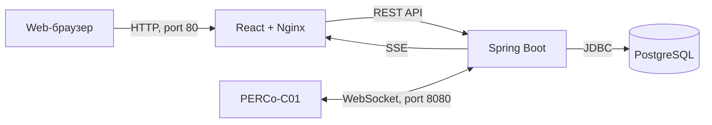

# Diamond Shield - Lite


**Diamond Shield - Lite** — минимальная клиент-серверная система контроля доступа для работы с контроллером **PERCo-C01** по протоколу WebSocket.

Система принимает события предъявления карт и проходов, сопоставляет идентификатор карты с человеком в базе данных, показывает фотографию и ФИО в реальном времени, сохраняет журнал событий и позволяет управлять контроллерами и считывателями.

> Проект является минимальной версией системы контроля доступа. Перед промышленной эксплуатацией необходимо дополнительно настроить HTTPS/WSS, резервное копирование и защиту сетевого доступа.

---

## Содержание

- [Возможности](#возможности)
- [Скриншоты](#скриншоты)
- [Архитектура](#архитектура)
- [Технологии](#технологии)
- [Структура репозитория](#структура-репозитория)
- [Docker-образы](#docker-образы)
- [Требования](#требования)
- [Быстрый запуск](#быстрый-запуск)
- [Настройка PostgreSQL](#настройка-postgresql)
- [Запуск Docker-контейнеров](#запуск-docker-контейнеров)
- [Подключение контроллера PERCo](#подключение-контроллера-perco)
- [Резервное копирование](#резервное-копирование)
- [API](#api)
- [Безопасность](#безопасность)
- [Ограничения](#ограничения)
- [Название проекта](#название-проекта)

---

## Возможности

### Работа с людьми

- добавление человека в систему;
- хранение фамилии, имени и отчества;
- привязка идентификатора карты;
- загрузка фотографии;
- ограничение размера фотографии до 100 КБ;
- поддержка JPEG, PNG и WebP;
- активация и блокировка карты;
- удаление человека.

### Работа с контроллерами

- добавление контроллера по IP-адресу;
- входящее WebSocket-подключение от PERCo-C01;
- исходящее WebSocket-подключение к контроллеру;
- автоматическое переподключение;
- авторизация контроллера через `MD5(salt + password)`;
- отправка JSON-команд протокола;
- добавление и удаление считывателей;
- открытие исполнительного устройства;
- запрет прохода;
- запрос состояния контроллера.

### События в реальном времени

- получение события предъявления карты;
- поиск человека по идентификатору карты;
- отображение фотографии и ФИО;
- отображение неизвестных карт;
- автоматическое разрешение прохода активной карте;
- автоматический запрет прохода неизвестной или заблокированной карте;
- фоторяд в реальном времени через Server-Sent Events;
- одновременное отображение шести последних событий.

### Журнал

- сохранение событий прохода;
- дата и время события;
- ФИО;
- идентификатор карты;
- название контроллера;
- номер исполнительного устройства;
- направление;
- результат доступа;
- экспорт журнала в XLSX.

### Администрирование

- авторизация через Spring Security;
- хранение паролей администраторов в BCrypt;
- добавление администраторов;
- удаление администраторов;
- защита от удаления текущего пользователя;
- защита от удаления последнего администратора.

---

## Скриншоты

### Авторизация


### Фоторяд в реальном времени


Фоторяд показывает шесть последних событий. При появлении нового события самая старая карточка справа удаляется.

### Люди


### Журнал событий


### Контроллеры и считыватели


### Администраторы


### Экспорт в XLSX


---

## Архитектура



Приложение состоит из двух Docker-контейнеров:

1. `frontend` — React-приложение, размещённое в Nginx;
2. `backend` — Spring Boot приложение.

PostgreSQL устанавливается непосредственно в Ubuntu и не запускается в Docker.

---

## Технологии

### Backend

- Java 17;
- Spring Boot;
- Spring Web;
- Spring WebSocket;
- Spring Security;
- Spring Data JPA;
- Hibernate;
- Gson;
- Flyway;
- Apache POI;
- PostgreSQL;
- Maven.

### Frontend

- React;
- TypeScript;
- Vite;
- Server-Sent Events;
- Nginx.

### Инфраструктура

- Docker;
- Docker Compose;
- PostgreSQL;
- Ubuntu;
- Docker Hub.

---

## Структура репозитория
```
├── backend/
│   ├── Dockerfile
│   ├── pom.xml
│   └── src/
└── frontend/
    ├── Dockerfile
    ├── nginx.conf
    ├── package.json
    └── src/
```

---

## Docker-образы

Готовые Docker-образы опубликованы в Docker Hub.

### Backend

[](https://hub.docker.com/repository/docker/rewoly/diamond-shield-lite-backend/general)

```bash
docker pull rewoly/diamond-shield-lite-backend:latest
```
Список версий:
```text
https://hub.docker.com/r/rewoly/diamond-shield-lite-backend/tags
```

### Frontend

[](https://hub.docker.com/repository/docker/rewoly/diamond-shield-lite-frontend/general)

```bash
docker pull rewoly/diamond-shield-lite-frontend:latest
```
Список версий:
```text
https://hub.docker.com/r/rewoly/diamond-shield-lite-frontend/tags
```

---

## Требования

Для запуска необходимы:

- Ubuntu 22.04 или новее;
- PostgreSQL 14 или новее;
- Docker Engine;
- Docker Compose Plugin;
- открытый порт `80` для сайта;
- открытый порт `8080` для контроллера PERCo;
- минимум 2 ГБ оперативной памяти;
- минимум 5 ГБ свободного дискового пространства.

---

## Быстрый запуск

### 1. Клонирование репозитория

```bash
git clone https://github.com/afanasevrev/diamond_shield_lite.git
```

```bash
cd diamond_shield_lite
```

### 2. Создание `.env`

Создайте файл и введите:

Пример:
```env
IMAGE_VERSION=latest
DOCKERHUB_USERNAME=YOUR_DOCKERHUB_USERNAME

DB_NAME=diamond_shield
DB_USER=diamond
DB_PASSWORD=CHANGE_ME_DATABASE_PASSWORD

DEFAULT_ADMIN_USERNAME=admin
DEFAULT_ADMIN_PASSWORD=CHANGE_ME_ADMIN_PASSWORD
```

Обязательно замените пароли.

Ограничьте доступ к файлу.

### 3. Подготовка PostgreSQL

```bash
sudo -u postgres psql
```

```sql
CREATE USER diamond
WITH PASSWORD 'CHANGE_ME_DATABASE_PASSWORD';

CREATE DATABASE diamond_shield
OWNER diamond;

GRANT ALL PRIVILEGES
ON DATABASE diamond_shield
TO diamond;
```

```sql
\q
```

### 4. Настройка PostgreSQL для Docker

В файле `postgresql.conf` установите:

```text
listen_addresses = '*'
```

Добавьте в `pg_hba.conf`:

```text
host   diamond_shield   diamond   172.30.0.0/24   scram-sha-256
```

Перезапустите PostgreSQL:

```bash
sudo systemctl restart postgresql
```

### 5. Запуск приложения

Скачайте Docker-образы:

```bash
docker compose -f docker-compose.prod.yml pull
```

Запустите:

```bash
docker compose -f docker-compose.prod.yml up -d
```
Проверьте:

```bash
docker compose -f docker-compose.prod.yml ps
```
Посмотрите логи backend:

```bash
docker compose -f docker-compose.prod.yml logs -f backend
```

### 6. Открытие приложения

Узнайте IP Ubuntu:

```bash
hostname -I
```

Откройте в браузере:

```text
http://IP_UBUNTU
```
Например:

```text
http://192.168.1.10
```

---

## Настройка PostgreSQL

Backend работает в Docker, а PostgreSQL — непосредственно в Ubuntu.

Поэтому backend подключается к PostgreSQL через:

```text
host.docker.internal:5432
```

В `docker-compose.prod.yml` используется:

```yaml
extra_hosts:
  • "host.docker.internal:host-gateway"
```

JDBC-адрес:

```text
jdbc:postgresql://host.docker.internal:5432/diamond_shield
```

Использовать `localhost` внутри backend-контейнера нельзя, потому что `localhost` будет указывать на сам контейнер.

### Проверка PostgreSQL

```bash
sudo systemctl status postgresql
```

Проверка порта:

```bash
sudo ss -lntp | grep 5432
```

Проверка базы:

```bash
sudo -u postgres psql -d diamond_shield
sql
\dt
```

После первого запуска Flyway должен создать таблицы:

```text
admins
persons
access_controllers
readers
passage_events
flyway_schema_history
```

---

## Запуск Docker-контейнеров

### Запуск

```bash
docker compose -f docker-compose.prod.yml up -d
```

### Состояние

```bash
docker compose -f docker-compose.prod.yml ps
```

### Логи backend

```bash
docker compose -f docker-compose.prod.yml logs -f backend
```
### Логи frontend

```bash
docker compose -f docker-compose.prod.yml logs -f frontend
```

### Остановка

```bash
docker compose -f docker-compose.prod.yml stop
```

### Повторный запуск

```bash
docker compose -f docker-compose.prod.yml start
```

### Удаление контейнеров

```bash
docker compose -f docker-compose.prod.yml down
```

PostgreSQL и его данные при этом не удаляются.

---

## Подключение контроллера PERCo

Для входящего подключения контроллера используется адрес:

```text
ws://IP_UBUNTU:8080/tcp
```

Например:

```text
ws://192.168.1.10:8080/tcp
```

Перед подключением контроллер необходимо добавить в интерфейсе Diamond Shield - Lite. IP-адрес в системе должен совпадать с реальным IP контроллера.

Если у контроллера установлен пароль, backend автоматически выполняет авторизацию:

```text
MD5(salt + password)
```

### Проверка порта с Windows

```powershell
Test-NetConnection 192.168.1.10 -Port 8080
```

Ожидаемый результат:

```text
TcpTestSucceeded: True
```

---

## Резервное копирование

Создать резервную копию PostgreSQL:

```bash
sudo -u postgres pg_dump \
  -Fc \
  diamond_shield \
  > ~/diamond_shield_backup.dump
```

Проверить файл:

```bash
ls -lh ~/diamond_shield_backup.dump
```

Восстановить:

```bash
sudo -u postgres pg_restore \
  --clean \
  --if-exists \
  --dbname=diamond_shield \
  ~/diamond_shield_backup.dump
```

Перед обновлением приложения рекомендуется создавать резервную копию.

---

## API

Основные endpoints:

| Метод | Endpoint | Описание |
|---|---|---|
| `GET` | `/api/auth/me` | Текущий пользователь |
| `GET` | `/api/persons` | Список людей |
| `POST` | `/api/persons` | Добавление человека |
| `GET` | `/api/persons/{id}/photo` | Фотография |
| `GET` | `/api/history` | Журнал событий |
| `GET` | `/api/history/export.xlsx` | Экспорт XLSX |
| `GET` | `/api/controllers` | Список контроллеров |
| `POST` | `/api/controllers` | Добавление контроллера |
| `POST` | `/api/controllers/{id}/connect` | Подключение |
| `POST` | `/api/controllers/{id}/command` | Отправка JSON-команды |
| `GET` | `/api/controllers/{id}/readers` | Считыватели |
| `POST` | `/api/controllers/{id}/readers` | Добавление считывателя |
| `GET` | `/api/admins` | Администраторы |
| `POST` | `/api/admins` | Добавление администратора |
| `DELETE` | `/api/admins/{id}` | Удаление администратора |
| `GET` | `/api/live/cards` | SSE-фоторяд |

---

## Безопасность

Текущая версия использует Spring Security и HTTP Basic Authentication.

Пароли администраторов хранятся в PostgreSQL в виде BCrypt-хешей.

При этом HTTP Basic без HTTPS не обеспечивает шифрование передаваемых данных. Использовать приложение по обычному HTTP следует только в доверенной локальной сети.

Перед использованием через интернет необходимо:

- настроить HTTPS;
- настроить WSS;
- использовать TLS-сертификат;
- ограничить сетевой доступ к порту `8080`;
- не открывать PostgreSQL в интернет;
- заменить Basic Authentication на защищённые cookie или JWT;
- зашифровать пароли контроллеров в базе;
- настроить регулярное резервное копирование.

---

## Ограничения

- текущая версия предоставляет базовое правило доступа: активная известная карта разрешена, неизвестная или заблокированная карта запрещена;
- отсутствуют временные расписания доступа;
- отсутствуют группы доступа;
- отсутствует распределение прав между администраторами;
- пароль контроллера в минимальной версии хранится в базе без дополнительного прикладного шифрования;
- точный WebSocket URL исходящего подключения зависит от конфигурации контроллера PERCo.

---

## Название проекта

**Diamond Shield - Lite**

Репозиторий:

```text
https://github.com/afanasevrev/diamond_shield_lite
```

Docker Hub backend:

```text
https://hub.docker.com/r/rewoly/diamond-shield-lite-backend
```

Docker Hub frontend:

```text
https://hub.docker.com/r/rewoly/diamond-shield-lite-frontend
```
